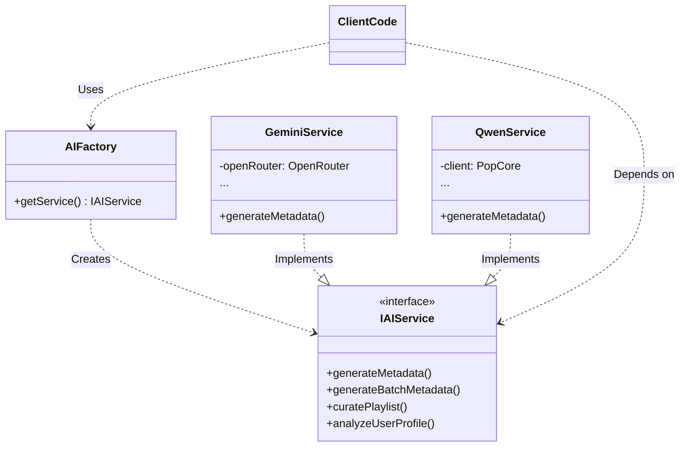

# AI 架构与 LLM 集成指南

本文档详细说明了 NaviMuse 项目中 AI 处理、LLM 调用、模型切换及关键代码实现的架构设计。旨在为开发者提供参考，以便理解现有系统或在其他项目中借鉴。

## 1. 架构概览 (Architecture Overview)

本项目采用 **工厂模式 (Factory Pattern)** 与 **策略模式 (Strategy Pattern)** 相结合的方式来管理 AI 服务。核心目标是实现业务逻辑与具体 AI 提供商（Provider）的解耦，支持运行时动态切换模型和提供商。

### 核心组件关系图



## 2. 核心组件 (Core Components)

### 2.1 AIFactory (服务工厂)
`src/services/ai/AIFactory.ts` 是获取 AI 服务的唯一入口。它负责根据配置（数据库设置 > 环境变量 > 默认值）实例化并返回具体的服务实现。

**关键特性：**
*   **优先级机制**：优先读取数据库中的动态配置，其次是环境变量，最后是硬编码默认值。
*   **动态切换**：无需重启服务，修改数据库配置后下次调用即可生效（需配合前端/API更新配置）。

### 2.2 IAIService (标准接口)
`src/services/ai/IAIService.ts` 定义了所有 AI 服务必须实现的方法。这确保了业务层代码（如 `QueueManagerService`）不需要知道底层使用的是 Gemini 还是 Qwen。

### 2.3 System Prompts (提示词管理)
`src/services/ai/systemPrompt.ts` 集中管理所有的 System Prompts。
*   **Prompt Engineering**：针对不同任务（元数据生成、歌单策展、用户画像）设计了高度定制的 Prompt。
*   **结构化输出**：强制要求 LLM 输出 JSON 格式，并定义了严格 schema (XML-like tags in prompt) 以提高稳定性。
*   **JsonRepair**：配合 `aiUtils.ts` 中的工具，处理 LLM 可能输出的 Markdown 代码块或非标准 JSON。

## 3. 配置与模型切换 (Configuration & Switching)

### 3.1 环境变量 (.env)
系统支持以下基础环境变量配置：

```bash
# AI Provider Selection (gemini, aliyun, etc.)
AI_PROVIDER=gemini 

# OpenRouter Configuration (Used by GeminiService)
OPENROUTER_API_KEY=sk-or-v1-...
GEMINI_MODEL=google/gemini-2.0-flash-exp:free

# Network Proxy
HTTPS_PROXY=http://127.0.0.1:7890
```

### 3.2 运行时切换逻辑
`AIFactory` 通过检查 `system_settings` 表中的配置来决定实例化哪个服务。

**代码逻辑 (`AIFactory.ts`):**
```typescript
static getService(): IAIService {
    // 1. 获取配置: DB > Env > Default
    const dbProvider = systemRepo.getSetting('ai_provider');
    const provider = dbProvider || process.env.AI_PROVIDER || 'gemini';

    // 2. 根据 provider 实例化对应服务
    if (provider === 'gemini' || provider === 'openrouter') {
        return new GeminiService();
    }
    // 默认回退或指定 aliyun 时使用 QwenService
    return new QwenService();
}
```

**模型的具体选择**通常在具体的 Service 内部处理（例如 `GeminiService` 会再次查询 `ai_model` 设置）。

## 4. 关键实现细节 (Implementation Details)

### 4.1 代理支持 (Proxy Support)
在国内环境下调用 Google/OpenAI 等服务通常需要代理。`GeminiService` 即使使用 `OpenRouter` SDK，也需要在底层 `fetch` 中注入代理。

**实现方式 (`GeminiService.ts`):**
```typescript
import { HttpsProxyAgent } from 'https-proxy-agent';
import nodeFetch from 'node-fetch';

// 在构造函数中
const proxyUrl = process.env.HTTPS_PROXY;
if (proxyUrl) {
    const agent = new HttpsProxyAgent(proxyUrl);
    // 劫持/覆盖全局 fetch 或 SDK 的 fetch 实现
    global.fetch = async (input, init) => {
        // ... 将 agent 注入到请求 options 中
        return nodeFetch(url, { agent, ...init });
    };
}
```

### 4.2 JSON 修复与鲁棒性 (JSON Repair)
LLM 输出经常包含 Markdown 标记（```json ... ```）或尾部逗号错误。本项目使用 `json5` 和自定义清洗逻辑来确保解析成功。

**清洗流程 (`aiUtils.ts` & `systemPrompt.ts`):**
1.  `cleanMarkdown()`: 移除 \`\`\`json 标记。
2.  `repairJson()`: 尝试修复常见的 JSON 语法错误。
3.  `JSON5.parse()`: 使用更宽松的解析器进行解析。

### 4.3 提示词工程示例
查看 `METADATA_SYSTEM_PROMPT`，可以看到使用了 XML 标签来定义角色、策略和输出 Schema。

```xml
<system_config>
  <role>Ultra-Precision Music Embedding Architect</role>
  ...
</system_config>

<output_schema>
  interface SongEmbeddingData {
    id: string | number;
    vector_anchor: { ... };
    ...
  }
</output_schema>
```

这种结构化 Prompt 能显著提升 LLM 输出符合预期格式的概率。

## 5. 示例代码 (Code Examples)

### 5.1 调用 AI 服务生成元数据

```typescript
import { AIFactory } from './services/ai/AIFactory';

async function processSong(song: Song) {
    try {
        // 1. 获取当前激活的 AI 服务
        const aiService = AIFactory.getService();

        // 2. 调用生成接口
        const metadata = await aiService.generateMetadata(song.artist, song.title);

        // 3. 使用结果
        console.log("Vector Anchor:", metadata.vector_anchor);
    } catch (error) {
        console.error("AI Processing Failed:", error);
    }
}
```

### 5.2 添加新的 AI 提供商 (e.g., DeepSeek)

1.  **创建 Service 类**: 实现 `IAIService` 接口。
2.  **注册到 Factory**: 修改 `AIFactory.ts`。

**DeepSeekService.ts:**
```typescript
export class DeepSeekService implements IAIService {
    async generateMetadata(artist: string, title: string): Promise<MetadataJSON> {
        // Implementation using DeepSeek API
    }
    // ... Implement other methods
}
```

**AIFactory.ts:**
```typescript
if (provider === 'deepseek') {
    return new DeepSeekService();
}
```

## 6. 总结 (Summary)

*   **解耦**: 业务代码只依赖 `IAIService`。
*   **灵活**: 支持 Env 和 DB 双重配置，支持运行时切换。
*   **鲁棒**: 内置 Proxy 支持和 JSON 容错处理。
*   **扩展**: 通过 Factory 模式轻松扩展新的 LLM Provider。

## 7. 依赖的三方库 (Third-Party Dependencies)

为了确保本模块（`src/services/ai`）在其他项目中开箱即用，请安装以下核心依赖：

### 7.1 核心依赖列表

| 包名 | 用途 | 备注 |
| :--- | :--- | :--- |
| `openai` | 通用 SDK | QwenService (阿里云百炼) 使用兼容 OpenAI 的 SDK |
| `@openrouter/sdk` | Gemini/OpenRouter | 用于 GeminiService，提供标准化的 OpenRouter 访问 |
| `node-fetch` | HTTP 请求 | Node.js 环境下的 Fetch API 实现（推荐 v2.x 以兼容 CommonJS） |
| `https-proxy-agent` | 网络代理 | **关键依赖**：解决国内服务器访问 Google/OpenAI 的网络问题 |
| `json5` | JSON 解析 | **关键依赖**：比原生 `JSON.parse` 更宽松，能解析尾随逗号和非标 JSON |

### 7.2 安装命令

**npm:**
```bash
npm install openai @openrouter/sdk node-fetch@2 https-proxy-agent json5
npm install -D @types/node-fetch@2
```

**yarn:**
```bash
yarn add openai @openrouter/sdk node-fetch@2 https-proxy-agent json5
yarn add -D @types/node-fetch@2
```

### 7.3 注意事项
*   **node-fetch 版本**: 本项目使用了 `node-fetch` v2.x。如果您的项目环境是 Node 18+ 原生支持 fetch，可以移除该依赖，但需注意调整 `GeminiService` 中的代理注入逻辑（从 `global.fetch` 改为直接使用 `undici` 的 Dispatcher 或类似机制）。
*   **OpenAI SDK**: 阿里云 Qwen兼容 OpenAI 协议，因此使用的是官方 `openai` 包，但修改了 `baseURL`。

## 8. 核心功能实现源码 (Core Implementation Reference)

为方便在其他项目中直接复用，以下提供了关键模块的完整或核心实现代码。

### 8.1 通用工具类 `aiUtils.ts` (JSON Repair & Utils)
包含最重要的 `repairJson` 逻辑，处理 LLM 输出的各种非标 JSON 格式（如 Markdown 包装、尾随逗号、错误的括号匹配等）。

```typescript
// aiUtils.ts
import JSON5 from 'json5';

/**
 * 修复 AI 输出的 JSON 字符串
 * 处理包括：Markdown 标记、尾随逗号、括号不匹配、字段扁平化等问题
 */
export function repairJson(content: string): string {
    let repaired = content.trim();

    // 1. 移除 Markdown 代码块
    repaired = repaired.replace(/```json/g, '').replace(/```/g, '').trim();

    // 2. 移除无效的 Unicode 字符
    repaired = repaired.replace(/[\uFFFD\u0000-\u001F]/g, '');

    // 3. 修复常见的括号误用 (圆括号代替花括号)
    repaired = repaired.replace(/"scene_tag"\s*:\s*"[^"]*"\s*\)/g, (match) => {
        return match.slice(0, -1) + '}';
    });

    // 4. 修复数组闭合错误
    repaired = repaired.replace(/(\],\s*"language")/g, '},"language"');

    // 5. 修复 vector_anchor 被扁平化为字符串的问题 (Project Specific pattern)
    // 示例: "vector_anchor": "some text" -> "vector_anchor": { "acoustic_model": "some text" ... }
    const vectorAnchorFlatPattern = /"vector_anchor"\s*:\s*"([^"]+)"/g;
    repaired = repaired.replace(vectorAnchorFlatPattern, (match, textContent) => {
         return `"vector_anchor":{"acoustic_model":"${textContent}","semantic_push":"[Auto-repaired]","cultural_weight":"[Auto-repaired]"}`;
    });

    // 6. 自动补全末尾缺失的 ]
    if (repaired.startsWith('[') && !repaired.endsWith(']')) {
        const lastBrace = repaired.lastIndexOf('}');
        if (lastBrace > 0) repaired = repaired.slice(0, lastBrace + 1) + ']';
    }

    // 7. 清理连续逗号
    repaired = repaired.replace(/,\s*,/g, ',');
    repaired = repaired.replace(/,\s*\]/g, ']'); // 移除数组尾随逗号
    repaired = repaired.replace(/,\s*\}/g, '}'); // 移除对象尾随逗号

    return repaired;
}

/**
 * 清理 Markdown 标记
 */
export function cleanMarkdown(content: string): string {
    return content.replace(/```json/g, '').replace(/```/g, '').trim();
}

/**
 * 安全解析器 (推荐)
 */
export function safeParse(content: string): any {
    const cleaned = repairJson(content);
    return JSON5.parse(cleaned);
}
```

### 8.2 服务工厂 `AIFactory.ts`
展示如何读取动态配置并实例化服务。

```typescript
// AIFactory.ts
import { IAIService } from './IAIService';
import { GeminiService } from './GeminiService';
import { QwenService } from './QwenService';
// 假设有一个 systemRepo 用于读取数据库配置
// import { systemRepo } from '../../db';

export class AIFactory {
    static getService(): IAIService {
        // 优先级: 数据库设置 > 环境变量 > 默认值
        // const dbProvider = systemRepo.getSetting('ai_provider'); 
        const provider = process.env.AI_PROVIDER || 'gemini';

        console.log(`[AIFactory] Provider: ${provider}`);

        if (provider.toLowerCase() === 'gemini' || provider.toLowerCase() === 'openrouter') {
            return new GeminiService();
        }
        
        // 默认回退
        return new QwenService();
    }
}
```

### 8.3 代理配置 `GeminiService.ts` (Core Snippet)
展示如何在 Node.js 中为 `fetch` API 配置全局代理，这对于国内服务器至关重要。

```typescript
// GeminiService.ts (Constructor snippet)
import { HttpsProxyAgent } from 'https-proxy-agent';
import nodeFetch from 'node-fetch'; // v2
import { OpenRouter } from '@openrouter/sdk';

export class GeminiService {
    private openRouter: OpenRouter;

    constructor() {
        const apiKey = process.env.OPENROUTER_API_KEY;
        
        // Proxy Configuration Logic
        const proxyUrl = process.env.HTTPS_PROXY;
        if (proxyUrl) {
            console.log(`[Proxy] Enabled: ${proxyUrl}`);
            const agent = new HttpsProxyAgent(proxyUrl);

            // 劫持全局 fetch (针对 SDK 内部使用 fetch 的情况)
            // @ts-ignore
            global.fetch = async (input: RequestInfo, init?: RequestInit) => {
                let url = '';
                let options: any = { agent, ...init }; // Inject Proxy Agent

                if (typeof input === 'string') {
                    url = input;
                } else if (typeof input === 'object' && 'url' in input) {
                    // Handle Request object
                    url = (input as any).url;
                    options.method = options.method || (input as any).method;
                    options.headers = options.headers || (input as any).headers;
                }
                
                return nodeFetch(url, options);
            };
        }

        this.openRouter = new OpenRouter({ apiKey });
    }
}
```


